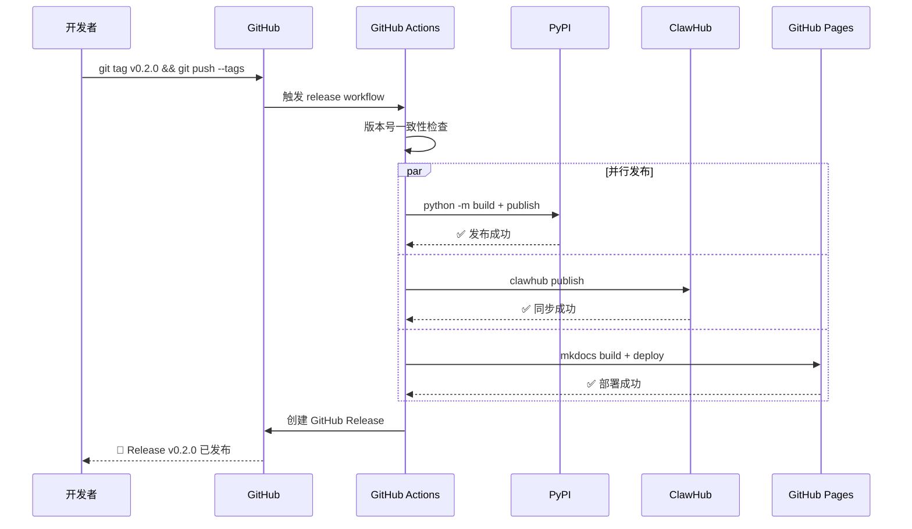
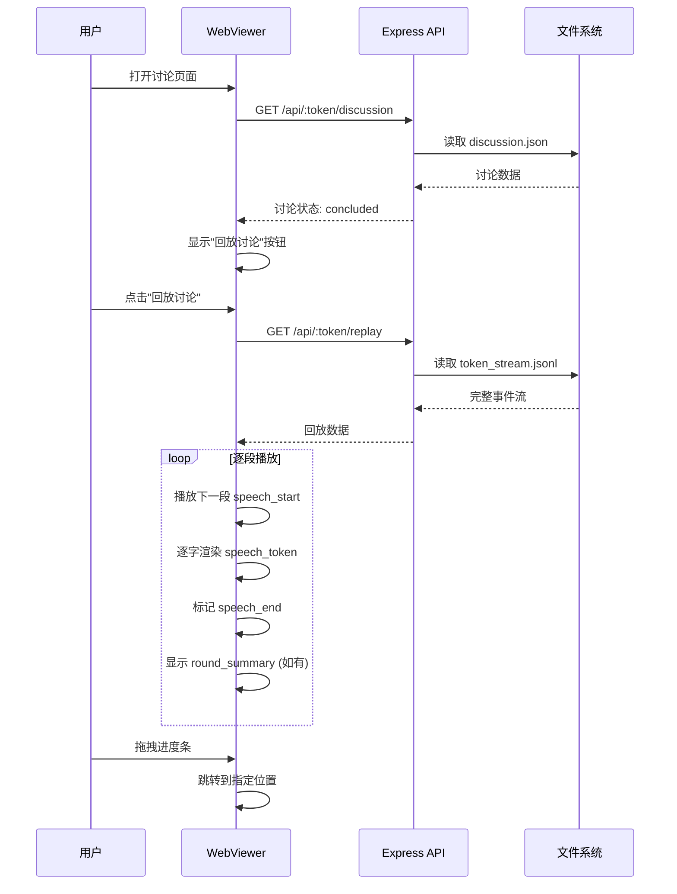
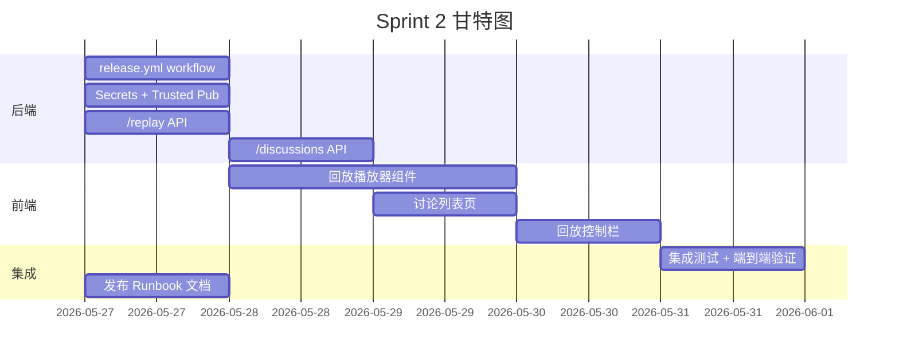

# agent-roundtable v2 Sprint 2 PRD — 发布自动化 + 讨论回放

> **版本**: 1.0
> **日期**: 2026-05-26
> **状态**: 草稿
> **产品负责人**: 饼哥
> **关联讨论**: rt_8aef3fe0（圆桌讨论共识）
> **分支**: feature/v2-ux-improvements

---

## 1. 背景与目标

### 1.1 问题

Sprint 1 完成了流式输出 + 协调者观点展示，WebViewer 的实时体验大幅提升。但存在两个新的效率瓶颈：

1. **发布流程手动繁琐**：每次发版需要手动触发 PyPI workflow、手动更新 ClawHub、手动同步 GitHub Pages，三个渠道各自操作，容易遗漏或版本不一致。
2. **讨论无法回看**：讨论结束后，用户只能看到最终结果，无法回顾"AI 是如何一步步达成共识的"。token_stream.jsonl 已经记录了完整的 token 流，但没有回放 UI。

### 1.2 目标

Sprint 2 聚焦两个核心效率升级：

| 优先级 | 功能 | 核心价值 |
|--------|------|---------|
| **P0** | 发布自动化（tag push 触发全渠道同步） | 一条命令发三端，消除人工遗漏风险 |
| **P1** | 讨论回放模式 | 用户可逐段回看 AI 讨论过程，提升内容传播价值 |

### 1.3 非目标（Sprint 2 不做）

- WebSocket 双向交互
- 导出/嵌入功能
- 多 Token 访问控制
- 讨论回放的倍速/跳转功能（作为 Sprint 3 预研）

---

## 2. 目标用户

| 用户类型 | 场景 | Sprint 2 痛点 |
|---------|------|--------------|
| 项目维护者 | 发版上线 | 每次发版需手动操作 3 个渠道，耗时且易出错 |
| 内容创作者 | 分享讨论过程 | 只有最终结论，无法展示"AI 如何思考" |
| 技术决策者 | 回顾讨论细节 | 想看某个观点是如何形成的，但没有回放 |
| AI 爱好者 | 学习多 Agent 协作 | 想观察 Agent 间的互动模式和推理链 |

---

*（下一章节：功能需求）*

## 3. 功能需求

### 3.1 P0 — 发布自动化

#### 3.1.1 用户故事

> 作为项目维护者，我希望在 GitHub 打 tag 后，PyPI、ClawHub、GitHub Pages 三个渠道自动同步更新，这样我只需一条命令就能完成全渠道发布。

#### 3.1.2 当前发布状态

| 渠道 | 状态 | 当前方式 | 问题 |
|------|------|---------|------|
| PyPI | 待发布 | workflow_dispatch 手动触发 | 需要手动选参数，容易忘记 |
| ClawHub | ✅ 已上线 | 手动 `clawhub publish` | 与 PyPI 版本可能不一致 |
| GitHub Pages | ✅ 已上线 | 推送 gh-pages 分支 | 需要手动构建和推送 |

#### 3.1.3 功能规格

| 编号 | 功能点 | 说明 | 验收标准 |
|------|--------|------|---------|
| F1.1 | Tag 触发发布 | 推送 `v*` 格式的 tag 自动触发全渠道发布 | `git tag v0.2.0 && git push --tags` 后自动执行 |
| F1.2 | PyPI 自动发布 | tag push 触发 PyPI 发布（沿用 Trusted Publishing） | 版本号与 pyproject.toml 一致，发布成功 |
| F1.3 | ClawHub 同步 | PyPI 发布成功后，自动触发 ClawHub 更新 | ClawHub 上的版本号与 PyPI 一致 |
| F1.4 | GitHub Pages 更新 | tag push 自动构建并部署文档到 GitHub Pages | 访问 Pages URL 显示最新版本文档 |
| F1.5 | 版本号一致性检查 | CI 阶段校验 tag 版本与 pyproject.toml 版本是否一致 | 不一致时 CI 失败并给出明确错误 |
| F1.6 | 发布通知 | 发布成功后自动通知（飞书/GitHub Release） | GitHub Release 自动创建，包含 CHANGELOG |
| F1.7 | 回滚机制 | 发布失败时可手动回滚（yank PyPI 版本） | 提供回滚 Runbook 文档 |

#### 3.1.4 发布流程图

```
git tag v0.2.0
git push --tags
       │
       ▼
┌─────────────────┐
│ GitHub Actions  │
│ (tag push 触发) │
└───────┬─────────┘
        │
        ▼
┌─────────────────┐     失败
│ 版本号一致性检查 ├────────────► CI 失败 + 通知
└───────┬─────────┘
        │ 通过
        ▼
┌─────────────────┐
│ Build sdist +   │
│ wheel           │
└───────┬─────────┘
        │
        ├──────────────────┬──────────────────┐
        ▼                  ▼                  ▼
┌───────────────┐ ┌───────────────┐ ┌───────────────┐
│ Publish PyPI  │ │ ClawHub 同步  │ │ GitHub Pages  │
│ (Trusted Pub) │ │ (clawhub CLI) │ │ (构建+部署)   │
└───────┬───────┘ └───────┬───────┘ └───────┬───────┘
        │                  │                  │
        └──────────────────┴──────────────────┘
                           │
                           ▼
                  ┌───────────────┐
                  │ 创建 GitHub   │
                  │ Release + 通知│
                  └───────────────┘
```

#### 3.1.5 Workflow 设计

```yaml
# .github/workflows/release.yml
name: Release

on:
  push:
    tags:
      - "v*"

jobs:
  # ─── Gate 0: 版本号一致性检查 ───────────────────────
  version-check:
    runs-on: ubuntu-latest
    steps:
      - uses: actions/checkout@v4
      - name: Check tag matches pyproject.toml version
        run: |
          TAG_VERSION=${GITHUB_REF#refs/tags/v}
          PKG_VERSION=$(python -c "
          import re
          with open('pyproject.toml') as f:
              print(re.search(r'version\s*=\s*\"(.+?)\"', f.read()).group(1))
          ")
          if [ "$TAG_VERSION" != "$PKG_VERSION" ]; then
            echo "::error::Tag version ($TAG_VERSION) != pyproject.toml version ($PKG_VERSION)"
            exit 1
          fi

  # ─── Build ─────────────────────────────────────────
  build:
    needs: version-check
    runs-on: ubuntu-latest
    steps:
      - uses: actions/checkout@v4
      - uses: actions/setup-python@v5
        with: { python-version: "3.12" }
      - run: pip install build twine
      - run: python -m build
      - run: twine check dist/*
      - uses: actions/upload-artifact@v4
        with:
          name: python-dist
          path: dist/*

  # ─── Publish to PyPI ──────────────────────────────
  publish-pypi:
    needs: build
    runs-on: ubuntu-latest
    environment: pypi
    permissions:
      id-token: write
    steps:
      - uses: actions/download-artifact@v4
        with: { name: python-dist, path: dist }
      - uses: pypa/gh-action-pypi-publish@release/v1

  # ─── Sync to ClawHub ──────────────────────────────
  publish-clawhub:
    needs: publish-pypi
    runs-on: ubuntu-latest
    steps:
      - uses: actions/checkout@v4
      - name: Install clawhub CLI
        run: pip install clawhub
      - name: Publish to ClawHub
        env:
          CLAWHUB_TOKEN: ${{ secrets.CLAWHUB_TOKEN }}
        run: clawhub publish --token $CLAWHUB_TOKEN

  # ─── Update GitHub Pages ──────────────────────────
  deploy-pages:
    needs: publish-pypi
    runs-on: ubuntu-latest
    permissions:
      pages: write
      id-token: write
    environment:
      name: github-pages
      url: ${{ steps.deployment.outputs.page_url }}
    steps:
      - uses: actions/checkout@v4
      - uses: actions/setup-python@v5
        with: { python-version: "3.12" }
      - name: Build docs
        run: |
          pip install mkdocs mkdocs-material
          mkdocs build
      - uses: actions/configure-pages@v4
      - uses: actions/upload-pages-artifact@v3
        with: { path: site }
      - id: deployment
        uses: actions/deploy-pages@v4

  # ─── Create GitHub Release ────────────────────────
  github-release:
    needs: [publish-pypi, publish-clawhub, deploy-pages]
    runs-on: ubuntu-latest
    permissions:
      contents: write
    steps:
      - uses: actions/checkout@v4
      - name: Extract changelog for this version
        id: changelog
        run: |
          VERSION=${GITHUB_REF#refs/tags/v}
          # Extract section between ## [X.Y.Z] and next ## [
          python -c "
          import re, sys
          with open('CHANGELOG.md') as f:
              content = f.read()
          pattern = r'## \[${VERSION}\].*?\n(.*?)(?=\n## \[|\Z)'
          match = re.search(pattern, content, re.DOTALL)
          print(match.group(1).strip() if match else 'No changelog entry found.')
          " >> $GITHUB_OUTPUT
      - name: Create GitHub Release
        uses: softprops/action-gh-release@v2
        with:
          tag_name: ${{ github.ref_name }}
          name: v${{ github.ref_name }}
          body: ${{ steps.changelog.outputs.changelog }}
          generate_release_notes: true
```

---

*（下一章节：讨论回放功能需求）*

### 3.2 P1 — 讨论回放模式

#### 3.2.1 用户故事

> 作为圆桌讨论的观众，我希望在讨论结束后可以回放整个过程，逐段查看每个 Agent 的发言，像看录像一样回看 AI 是如何一步步达成共识的。

> 作为内容创作者，我希望分享一个讨论回放链接，让读者能沉浸式体验 AI 讨论的全过程，而不只是看一个最终结论。

#### 3.2.2 功能规格

| 编号 | 功能点 | 说明 | 验收标准 |
|------|--------|------|---------|
| F2.1 | 回放入口 | 讨论结束后，WebViewer 页面显示"回放讨论"按钮 | 讨论状态为 concluded 时按钮可见 |
| F2.2 | 回放播放器 | 类似视频播放器的控制栏（播放/暂停/进度条） | 播放/暂停切换流畅，进度条可拖拽 |
| F2.3 | 逐段回放 | 按 speech 为单位逐段播放，每段内逐字流式显示 | 每段发言以流式效果呈现，与实时体验一致 |
| F2.4 | 进度指示 | 显示当前播放进度（第 N 段 / 共 M 殮，第 X 轮） | 进度信息实时更新 |
| F2.5 | 讨论列表 | 回放页面展示历史讨论列表，可选择回放 | 按时间倒序，显示讨论主题和参与 Agent |
| F2.6 | 回放速度控制 | 支持 1x / 2x / 4x 速度 | 切换速度后立即生效 |
| F2.7 | 跳过等待 | 回放模式下，Agent 间的等待时间可压缩 | 等待时间 > 2s 时自动压缩为 0.5s |
| F2.8 | 断点续播 | 回放中途关闭页面，再次打开可从上次位置继续 | localStorage 存储播放位置 |

#### 3.2.3 回放 UI 交互设计

```
┌─────────────────────────────────────────────────────┐
│  🎬 讨论回放 — "FastAPI vs Flask 技术选型"           │
│  ━━━━━━━━━━━━━━━━━━━━━━━━━━━━━━━━━━━━━━━━━━━━━━━━━ │
│                                                     │
│  🤖 Alice (GPT-4o)                                  │
│  ┌─────────────────────────────────────────────┐    │
│  │ 我认为 FastAPI 的性能优势在 IO 密集场景下...  │    │
│  └─────────────────────────────────────────────┘    │
│                                                     │
│  🧠 Bob (Claude)                                    │
│  ┌─────────────────────────────────────────────┐    │
│  │ 同意 Alice 的观点。但需要注意 FastAPI 的...   │    │
│  └─────────────────────────────────────────────┘    │
│                                                     │
│  ┏━━━━━━━━━━━━━━━━━━━━━━━━━━━━━━━━━━━━━━━━━━━━━┓    │
│  ┃ 📋 第 1 轮总结                               ┃    │
│  ┃ ✅ FastAPI 性能优势明确                      ┃    │
│  ┃ ⚠️ 迁移成本需评估                           ┃    │
│  ┗━━━━━━━━━━━━━━━━━━━━━━━━━━━━━━━━━━━━━━━━━━━━━┛    │
│                                                     │
│  ┌─────────────────────────────────────────────┐    │
│  │ 🎬 ▶ ━━━━━━━━━━●━━━━━━━━━━━━━━━ 12/36 段   │    │
│  │     01:23 / 05:40    第 1 轮 / 共 3 轮  1x  │    │
│  └─────────────────────────────────────────────┘    │
└─────────────────────────────────────────────────────┘
```

#### 3.2.4 讨论列表页

```
┌─────────────────────────────────────────────────────┐
│  📜 历史讨论                                        │
│  ━━━━━━━━━━━━━━━━━━━━━━━━━━━━━━━━━━━━━━━━━━━━━━━━━ │
│                                                     │
│  ┌─────────────────────────────────────────────┐    │
│  │ 🎬 FastAPI vs Flask 技术选型                 │    │
│  │    Alice · Bob · Carol    3 轮    05:40     │    │
│  │    2026-05-26 14:30                         │    │
│  └─────────────────────────────────────────────┘    │
│                                                     │
│  ┌─────────────────────────────────────────────┐    │
│  │ 🎬 AI Agent 协作模式探讨                     │    │
│  │    Dave · Eve · Frank    2 轮    03:20      │    │
│  │    2026-05-25 10:00                         │    │
│  └─────────────────────────────────────────────┘    │
│                                                     │
└─────────────────────────────────────────────────────┘
```

---

*（下一章节：技术方案）*

## 4. 产品流程图

### 4.1 发布自动化流程



### 4.2 讨论回放流程



### 4.3 数据流架构

```
讨论进行中（Sprint 1 已实现）：
  Roundtable → WebPublisher → token_stream.jsonl → Express → SSE → 浏览器

讨论回放（Sprint 2 新增）：
  token_stream.jsonl → Express /replay API → 浏览器回放引擎
                                                    ↓
                                              逐段播放 + 进度控制
```

---

*（下一章节：技术方案细节）*

## 5. 技术方案

### 5.1 发布自动化技术方案

#### 5.1.1 架构变更概览

```
现有流程（手动）：
  维护者 → 手动触发 PyPI workflow
  维护者 → 手动 clawhub publish
  维护者 → 手动推送 gh-pages

Sprint 2 流程（自动）：
  维护者 → git tag v0.2.0 && git push --tags
         → GitHub Actions 自动完成全渠道发布
```

#### 5.1.2 Workflow 文件变更

**删除**：`.github/workflows/publish.yml`（手动触发的旧 workflow）

**新增**：`.github/workflows/release.yml`（tag push 触发的新 workflow）

关键变更：
- 触发方式从 `workflow_dispatch` 改为 `push.tags: ["v*"]`
- 新增版本号一致性检查（Gate 0）
- 新增 ClawHub 同步 job
- 新增 GitHub Pages 部署 job
- 新增 GitHub Release 创建 job
- 所有 job 串行依赖，确保发布顺序可控

#### 5.1.3 Secrets 配置

| Secret 名称 | 用途 | 配置位置 |
|-------------|------|---------|
| `CLAWHUB_TOKEN` | ClawHub 发布认证 | GitHub repo Settings → Secrets |
| PyPI Trusted Publishing | PyPI 发布认证（OIDC） | PyPI 项目设置 |
| GitHub Pages | Pages 部署权限 | 自动（id-token: write） |

#### 5.1.4 版本号管理

```
pyproject.toml:
  version = "0.2.0"    ← 唯一版本来源

发布流程：
  1. 开发者更新 pyproject.toml 中的 version
  2. 更新 CHANGELOG.md
  3. commit + push
  4. git tag v0.2.0
  5. git push --tags
  6. CI 自动校验 tag 与 pyproject.toml 一致
```

---

### 5.2 讨论回放技术方案

#### 5.2.1 架构变更概览

```
现有（Sprint 1）：
  token_stream.jsonl → Express SSE 实时推送 → 浏览器

Sprint 2 新增：
  token_stream.jsonl → Express /replay API → 浏览器回放引擎
```

#### 5.2.2 Express 端新增 API

```javascript
// GET /api/:token/replay
// 返回 token_stream.jsonl 的完整内容，用于回放
app.get('/api/:token/replay', (req, res) => {
    const token = req.params.token;
    const tokenDir = resolveTokenDir(token);
    const streamFile = join(tokenDir, 'token_stream.jsonl');
    
    if (!existsSync(streamFile)) {
        return res.status(404).json({ error: 'No replay data available' });
    }
    
    const content = readFileSync(streamFile, 'utf-8');
    const events = content.split('\n')
        .filter(line => line.trim())
        .map(line => JSON.parse(line));
    
    res.json({
        discussion_id: basename(tokenDir),
        total_events: events.length,
        events: events
    });
});

// GET /api/:token/discussions
// 返回所有讨论列表（用于历史回放页面）
app.get('/api/:token/discussions', (req, res) => {
    const outputDir = resolveOutputDir();
    const discussions = [];
    
    // 扫描 output 目录，读取每个 discussion.json 的元数据
    for (const dir of readdirSync(outputDir)) {
        const discFile = join(outputDir, dir, 'discussion.json');
        if (existsSync(discFile)) {
            const disc = JSON.parse(readFileSync(discFile, 'utf-8'));
            discussions.push({
                id: disc.discussion_id,
                topic: disc.topic,
                participants: disc.participants?.length || 0,
                rounds: disc.rounds || 0,
                status: disc.status,
                created_at: disc.created_at
            });
        }
    }
    
    discussions.sort((a, b) => (b.created_at || 0) - (a.created_at || 0));
    res.json({ discussions });
});
```

#### 5.2.3 前端回放引擎

```javascript
class ReplayEngine {
    constructor(events, container) {
        this.events = events;           // 完整事件列表
        this.container = container;     // DOM 容器
        this.currentIndex = 0;          // 当前播放位置
        this.isPlaying = false;         // 播放状态
        this.speed = 1;                 // 播放速度
        this.speechGroups = this._groupBySpeech(events);
    }
    
    // 将事件按 speech 分组
    _groupBySpeech(events) {
        const groups = [];
        let current = null;
        
        for (const event of events) {
            if (event.type === 'speech_start') {
                current = { start: event, tokens: [], end: null };
            } else if (event.type === 'speech_token' && current) {
                current.tokens.push(event);
            } else if (event.type === 'speech_end' && current) {
                current.end = event;
                groups.push(current);
                current = null;
            } else if (event.type === 'round_summary' || event.type === 'final_summary') {
                groups.push({ summary: event });
            }
        }
        return groups;
    }
    
    // 播放指定段
    async playSpeech(group) {
        if (group.summary) {
            this._renderSummary(group.summary);
            await this._wait(1000 / this.speed);
            return;
        }
        
        // 创建气泡
        const bubble = this._createBubble(group.start);
        
        // 逐字渲染
        for (const token of group.tokens) {
            if (!this.isPlaying) return;
            this._appendToken(bubble, token.delta);
            await this._wait(50 / this.speed);  // token 间延迟
        }
        
        // 标记完成
        this._markComplete(bubble);
    }
    
    // 播放控制
    async play() {
        this.isPlaying = true;
        while (this.currentIndex < this.speechGroups.length && this.isPlaying) {
            await this.playSpeech(this.speechGroups[this.currentIndex]);
            this.currentIndex++;
            this._updateProgress();
            
            // 段间等待（压缩长等待）
            if (this.currentIndex < this.speechGroups.length) {
                await this._wait(500 / this.speed);
            }
        }
        this.isPlaying = false;
    }
    
    pause() { this.isPlaying = false; }
    
    seekTo(index) {
        this.currentIndex = Math.max(0, Math.min(index, this.speechGroups.length - 1));
        this._clearContainer();
        this._replayToCurrent();
    }
    
    setSpeed(speed) { this.speed = speed; }
}
```

#### 5.2.4 数据文件说明

回放功能完全基于 Sprint 1 已有的 `token_stream.jsonl` 文件，无需新增数据文件：

```
discussion_dir/
├── discussion.json          # 现有：完整讨论数据
├── token_stream.jsonl       # 现有：流式 token 序列（回放数据源）
└── .revoked_tokens          # 现有：已撤销的访问 token
```

token_stream.jsonl 格式回顾：
```
{"type":"speech_start","id":"s_xxx","agent":"Alice","avatar":"🤖","round":1,"timestamp":1779761742}
{"type":"speech_token","id":"s_xxx","delta":"我","seq":0,"timestamp":1779761742}
{"type":"speech_token","id":"s_xxx","delta":"认为","seq":1,"timestamp":1779761743}
{"type":"speech_end","id":"s_xxx","total_tokens":2,"timestamp":1779761743}
{"type":"round_summary","round":1,"consensus":[...],"disagreement":[...],"timestamp":1779761750}
```

---

*（下一章节：验收标准、工期）*

## 6. 数据结构变更

### 6.1 无新增数据结构

Sprint 2 不引入新的数据文件格式。回放功能完全基于 Sprint 1 的 `token_stream.jsonl`。

### 6.2 API 响应格式

#### 6.2.1 GET /api/:token/replay

```json
{
    "discussion_id": "rt_abc123",
    "total_events": 156,
    "events": [
        {"type": "speech_start", "id": "s_xxx", "agent": "Alice", "avatar": "🤖", "round": 1, "timestamp": 1779761742},
        {"type": "speech_token", "id": "s_xxx", "delta": "我", "seq": 0, "timestamp": 1779761742},
        // ... 更多事件
    ]
}
```

#### 6.2.2 GET /api/:token/discussions

```json
{
    "discussions": [
        {
            "id": "rt_abc123",
            "topic": "FastAPI vs Flask 技术选型",
            "participants": 3,
            "rounds": 3,
            "status": "concluded",
            "created_at": 1779761742
        }
    ]
}
```

---

## 7. 验收标准

### 7.1 P0 — 发布自动化

| 编号 | 验收项 | 标准 | 测试方法 |
|------|--------|------|---------|
| A1 | Tag 触发 | 推送 `v*` tag 后 workflow 自动运行 | 打测试 tag 验证 |
| A2 | 版本号检查 | tag 与 pyproject.toml 不一致时 CI 失败 | 故意制造不一致 |
| A3 | PyPI 发布 | 版本号正确，包可安装 | `pip install agent-roundtable==0.2.0` |
| A4 | ClawHub 同步 | ClawHub 版本与 PyPI 一致 | `clawhub search roundtable` |
| A5 | Pages 部署 | 访问 Pages URL 显示最新文档 | 浏览器访问验证 |
| A6 | Release 创建 | GitHub Release 自动创建，包含 CHANGELOG | 检查 Release 页面 |
| A7 | 全链路耗时 | 从 tag push 到全渠道可用 ≤ 10 分钟 | 计时验证 |

### 7.2 P1 — 讨论回放

| 编号 | 验收项 | 标准 | 测试方法 |
|------|--------|------|---------|
| B1 | 回放入口 | 讨论结束后显示"回放"按钮 | 完成一次讨论后观察 |
| B2 | 逐段播放 | 按 speech 顺序逐段播放，流式效果 | 完整回放一次讨论 |
| B3 | 播放控制 | 播放/暂停切换流畅 | 交互测试 |
| B4 | 进度条 | 可拖拽跳转到指定位置 | 拖拽进度条 |
| B5 | 速度控制 | 1x/2x/4x 切换正常 | 切换速度后观察 |
| B6 | 讨论列表 | 历史讨论可列表展示 | 访问列表页 |
| B7 | 断点续播 | 关闭后重新打开从上次位置继续 | 关闭/重开页面 |
| B8 | 移动端适配 | 微信内置浏览器可正常回放 | 微信真机测试 |

### 7.3 整体体验

| 编号 | 验收项 | 标准 | 测试方法 |
|------|--------|------|---------|
| C1 | 向后兼容 | Sprint 1 的实时功能不受影响 | 实时讨论流程测试 |
| C2 | 性能 | 回放 1000+ 事件无卡顿 | 大讨论回放测试 |
| C3 | 无数据丢失 | 回放内容与实时讨论完全一致 | 对比 token_stream.jsonl |

---

## 8. 风险与应对

| 风险 | 影响 | 应对策略 |
|------|------|---------|
| ClawHub CLI 在 CI 中不可用 | 发布链路中断 | 先验证 ClawHub CLI Docker 镜像或 pip 安装可行性 |
| PyPI Trusted Publishing 未配置 | PyPI 发布失败 | 提前配置好 OIDC，或使用 API Token 兜底 |
| token_stream.jsonl 文件过大 | 回放加载慢 | API 端做分页或流式返回，前端渐进加载 |
| 回放时 DOM 节点过多 | 页面卡顿 | 虚拟滚动或限制可见节点数 |
| GitHub Pages 构建失败 | 文档不可用 | 保留 gh-pages 分支手动推送作为兜底 |

---

## 9. 工期与分工

### 9.1 任务拆解

| 任务 | 负责人 | 工期 | 依赖 |
|------|--------|------|------|
| **后端：release.yml workflow 编写** | 码飞 | 0.5 天 | 无 |
| **后端：Secrets 配置 + Trusted Publishing** | 码飞 | 0.5 天 | 无 |
| **后端：/replay API 实现** | 码飞 | 0.5 天 | 无 |
| **后端：/discussions 列表 API** | 码飞 | 0.5 天 | 无 |
| **前端：回放播放器组件** | 像素姐 | 1.5 天 | /replay API |
| **前端：讨论列表页** | 像素姐 | 0.5 天 | /discussions API |
| **前端：回放控制栏（进度条/速度）** | 像素姐 | 0.5 天 | 回放播放器 |
| **集成测试 + 端到端验证** | 协调者 | 1 天 | 后端+前端完成 |
| **发布 Runbook 文档** | 饼哥 | 0.5 天 | 无 |

### 9.2 里程碑

```
Day 1:   后端核心（release workflow + /replay API）
Day 2:   前端核心（回放播放器 + 讨论列表）
Day 3:   前端完善（控制栏 + 断点续播）+ 集成联调
Day 4:   端到端验证 + 发布测试 tag 验证全链路
Day 5:   Buffer + Bug 修复 + Runbook 文档
```

**总工期**：5 个工作日

### 9.3 依赖关系



---

## 10. 设计交付物

像素姐需产出：

1. **回放播放器组件规范** — 控制栏布局、进度条样式、速度切换交互
2. **回放气泡样式** — 与实时模式的区分（如半透明/灰色边框）
3. **讨论列表页规范** — 卡片布局、筛选交互
4. **回放进度指示器** — 段数/轮次的展示方式
5. **移动端回放适配** — 控制栏收缩策略、触摸手势

---

## 11. 发布 Runbook（初稿）

### 11.1 正常发布流程

```bash
# 1. 确认版本号
grep version pyproject.toml  # 确认是目标版本

# 2. 更新 CHANGELOG
vim CHANGELOG.md  # 添加新版本条目

# 3. 提交变更
git add -A
git commit -m "release: prepare v0.2.0"
git push

# 4. 打 tag 并推送
git tag v0.2.0
git push --tags

# 5. 等待 CI 完成（约 5-10 分钟）
# 监控：https://github.com/MoyuFamily/agent-roundtable/actions

# 6. 验证
pip install agent-roundtable==0.2.0  # PyPI
clawhub search roundtable            # ClawHub
open https://moyufamily.github.io/agent-roundtable  # Pages
```

### 11.2 回滚流程

```bash
# PyPI 回滚（yank 版本）
# 在 PyPI Web UI 上 yank 该版本，或使用 twine:
pip install twine
twine yank agent-roundtable==0.2.0

# ClawHub 回滚
clawhub yank roundtable@0.2.0

# GitHub Pages 回滚
# 回退 gh-pages 分支到上一个 commit
git checkout gh-pages
git revert HEAD
git push

# GitHub Release
# 在 GitHub Web UI 上删除对应的 Release
```

---

## 12. 确认记录

- **2026-05-26**: PRD 初稿，基于圆桌讨论 rt_8aef3fe0 共识
- **待确认**: 饼哥（产品）、像素姐（设计）、码飞（技术）

---

*本文档由饼哥（产品总监）编写，如有疑问请联系产品负责人。*
